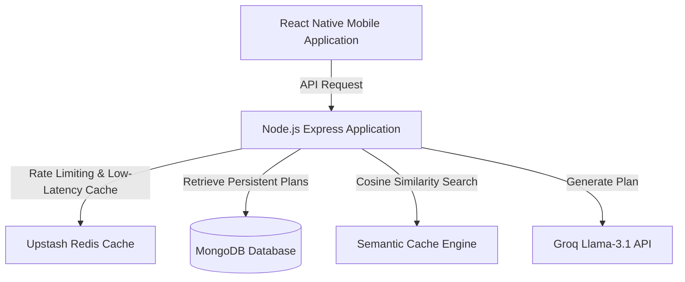

# Hobby Hub - Gamified Learning & Customized Roadmaps

Hobby Hub is a mobile application that generates customized, structured learning plans for any hobby. By defining your target hobby, skill level, and weekly time commitment, the application crafts a structured 3-step learning experience with dynamic chapter roadmaps, gamified widgets, and progressive interactive steps.

---

## 🌟 Features

- **AI-Powered Learning Plans**: Generates highly accurate, step-by-step chapters tailored to your specific hobby, experience level, and available weekly time.
- **Gamified Progression**: RPG-style leveling system with XP tracking, daily streak badges, and glowing timeline progress indicators.
- **Dynamic Interactive Content**: Auto-generates related YouTube videos, flashcards, and reading modules on the fly.
- **Smart Reflection Validation**: Interactive multiple-choice and short-answer verification to ensure material comprehension before advancing.
- **Ultra-Fast & Optimized**: Delivers instant course generation for previously requested topics through an advanced 3-tier caching system.

---

## 🛠 Tech Stack

### Frontend (Mobile Client)
- **Framework**: React Native (Bare CLI)
- **Language**: TypeScript
- **State Management**: Zustand (with persistent asynchronous storage)
- **Navigation**: React Navigation (Native Stack & Bottom Tabs)
- **Animations & UI**: React Native Reanimated, Bottom Sheet
- **Validation**: Zod (Shared schemas)

### Backend (API Application)
- **Environment**: Node.js
- **Framework**: Express.js
- **Language**: TypeScript
- **Database Layer**: MongoDB (Mongoose ODM)
- **Caching & Rate Limiting**: Upstash Redis (`ioredis`)
- **AI Engine**: Groq SDK (Llama-3.1 AI LLM)
- **Validation**: Zod (Shared schemas)

---

## 🚀 Getting Started

### Prerequisites
- Node.js (v22.11.0 or higher)
- MongoDB Database URI
- Upstash Redis Account Credentials
- Groq API Key
- YouTube Data API v3 Key (for video content searches)

### Repository Setup
Start by cloning the repository to your local machine:
```bash
git clone https://github.com/progressmantraclasses/Hobby-Hub.git
cd Hobby-Hub
```

### Backend Application Setup (`server/` directory)

1. Navigate to the backend directory:
   ```bash
   cd server
   ```

2. Install the application dependencies:
   ```bash
   npm install
   ```

3. Configure your local environment variables. Duplicate the `.env.example` file to `.env`:
   ```bash
   cp .env.example .env
   ```

4. Populate the `.env` file with your credentials:
   ```env
   PORT=5000
   MONGO_URI=mongodb+srv://<username>:<password>@cluster.mongodb.net/hobbyhub
   UPSTASH_REDIS_REST_URL=https://<your-database>.upstash.io
   UPSTASH_REDIS_REST_TOKEN=<your-token>
   GROQ_API_KEY=<your-groq-api-key>
   YOUTUBE_API_KEY=<your-youtube-api-key>
   ```

5. Start the local development listener process:
   ```bash
   npm run dev
   ```

6. Run the test suite:
   ```bash
   npm test
   ```

### Mobile Client Setup (`App/` directory)

1. Navigate to the mobile client directory:
   ```bash
   cd App
   ```

2. Install client dependencies:
   ```bash
   npm install
   ```

3. Start the React Native packager process:
   ```bash
   npm start
   ```

4. Launch the application on your target platform:
   - **Android**:
     ```bash
     npm run android
     ```
   - **iOS** (macOS required):
     ```bash
     npm run ios
     ```

---

## 🏗 Technical Architecture & Cost Optimization

The system utilizes a client-to-application flow where API calls are verified, throttled, and dynamically resolved through three distinct optimization layers before requesting expensive processing from LLMs.



### 1. Low-Latency Key-Value Cache (Upstash Redis)
- **Role**: Serves as the first line of defense for incoming API requests.
- **Plan Caching**: Successful plans are stored in Upstash Redis utilizing a normalized query key (e.g., `guitar:beginner:5` representing `hobby:level:weeklyTime`). If an exact matching request is made, the plan is served in milliseconds.
- **Sliding-Window Rate Limiter**: Redis ZSETs (Sorted Sets) are used to throttle incoming API requests per client to prevent spam and protect external API budgets.

### 2. Persistent Document Cache (MongoDB)
- **Role**: Long-term persistent cache layer for generated plans.
- **Fallback Flow**: If a query misses the memory cache, the application checks the MongoDB collection for an exact string match on `normalizedQuery`. If found, the document is returned and re-cached into Redis for future low-latency hits.

### 3. Semantic Caching Engine (Cosine Similarity Vector Search)
- **Role**: Intelligent cost optimization layer designed to catch semantically equivalent queries.
- **Concept**: If a user queries *"acoustic guitar lessons"* and another queries *"guitar basics"*, they are semantically similar but do not match the exact key `guitar:beginner:5`. 
- **Matching Algorithm**: The system leverages vector embeddings (Cosine Similarity) inside `semanticCache.service.ts` to identify plans that share an overlap score $\ge$ 0.85. 
- **Formula**:
  $$\text{Similarity} = \frac{\vec{A} \cdot \vec{B}}{\|\vec{A}\| \|\vec{B}\|}$$
- If a match is found, the existing custom plan is returned immediately, completely bypassing Groq API calls and saving substantial LLM token expenses.
