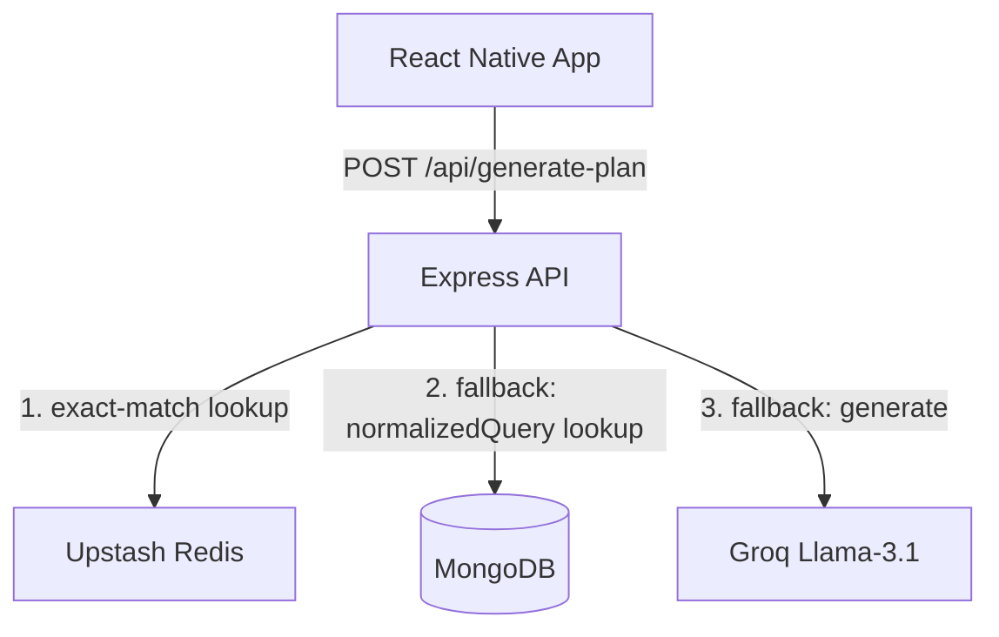

# Hobby Hub — Gamified Learning & Customized Roadmaps

Hobby Hub is a mobile application that generates customized, structured learning plans for any hobby. Given a target hobby, skill level, and weekly time commitment, the backend generates a multi-chapter roadmap via an LLM, and the mobile app walks the user through each chapter as a 7-step gamified learning flow (summary, video, reflection, reading, interactive activity, quiz, practice).

This is a monorepo with two independent projects:

```
Hobby-Hub/
├── App/      React Native mobile client
└── server/   Node.js / Express backend API
```

---

## Features

- **AI-generated learning plans** — a structured, multi-chapter roadmap tailored to hobby, experience level, and weekly time, generated via Groq's Llama-3.1.
- **Per-chapter generated content** — each chapter's 7-step learning flow (summary, video, reflection, reading, interactive activity, quiz, practice) is generated on demand and cached once generated.
- **Gamification** — XP, levels, daily streaks, badges, and per-hobby progress tracking, persisted locally.
- **Two-tier caching** — Redis (exact-match key-value cache) in front of MongoDB (persistent document cache), so a previously requested `hobby:level:weeklyTime` combination is served without hitting the LLM again.
- **Auto-fetched instructional videos** — YouTube search results are filtered and ranked by the LLM to attach a relevant video to each chapter's video step.

---

## Tech Stack

### Frontend — `App/` (React Native mobile client)
- **Framework:** React Native 0.86 (Bare CLI), React 19.2
- **Language:** TypeScript
- **State management:** Zustand, persisted to device storage via `@react-native-async-storage/async-storage`
- **Navigation:** React Navigation (native-stack + bottom-tabs)
- **Animations/UI:** React Native Reanimated, Gesture Handler, `@gorhom/bottom-sheet`, `react-native-svg`
- **Video:** `react-native-youtube-iframe`
- **Validation:** Zod
- **Testing:** Jest

### Backend — `server/` (API)
- **Runtime:** Node.js, Express 5
- **Language:** TypeScript
- **Database:** MongoDB via Mongoose
- **Cache / rate limiting:** Upstash Redis
- **AI:** Groq SDK (Llama-3.1)
- **External API:** YouTube Data API v3
- **Validation:** Zod
- **Testing:** Jest, Supertest, ts-jest

---

## Folder Structure

### `App/src/`
```
components/         Shared UI components
  stepRenderers/     One renderer per chapter step type (summary, video, reflection, reading, interactive, quiz, practice)
  resourceRenderers/ (currently empty — no components yet)
constants/           Static config data (badges, hobby lists/emoji, levels, chapter-status labels/colors, rank thresholds, tab icons)
hooks/               useAsyncTask (loading/error/success state for async calls), useIsWideScreen
navigation/          RootNavigator (stack + bottom tabs)
schemas/             Zod schemas shared with the shape returned by the backend (plan, chapter content)
screens/             One file per screen (Home, Hobby, Level, TimeCommitment, Course, CourseDetail, ChapterDetail, ChapterFlow, ChapterComplete, Dashboard, Profile)
services/            api.ts — fetch calls to the backend
store/               planStore.ts — Zustand store (hobbies, progress, XP/streak, onboarding draft fields)
theme/               colors.ts — the app's single design-token palette
utils/               Pure helper functions (XP/level math, streak-date math)
```

### `server/src/`
```
config/        env.ts (validated env vars), mongo.ts, redis.ts
controllers/   plan.controller.ts, chapter.controller.ts, video.controller.ts
routes/        plan.routes.ts, chapter.routes.ts, video.routes.ts
services/      groq.service.ts (LLM calls), youtube.service.ts, videoFilter.service.ts, semanticCache.service.ts
models/        Plan.model.ts, VideoCache.model.ts (Mongoose schemas)
schemas/       plan.schema.ts — Zod schemas (shared shape with the frontend)
middleware/    rateLimiter, validate, errorHandler
utils/         normalizeQuery.ts
tests/         Jest test suites
```

---

## Prerequisites

- Node.js v22.11.0 or higher
- A MongoDB connection string (e.g. MongoDB Atlas)
- An Upstash Redis database (REST URL + token)
- A Groq API key
- A YouTube Data API v3 key
- For running the mobile app: Android Studio (Android) and/or Xcode (iOS, macOS only)

---

## Setup

### 1. Clone the repository
```bash
git clone https://github.com/progressmantraclasses/Hobby-Hub.git
cd Hobby-Hub
```

### 2. Backend (`server/`)

```bash
cd server
npm install
cp .env.example .env
```

Fill in `.env` (see [Environment Variables](#environment-variables) below), then:

```bash
npm run dev     # starts the dev server with hot-reload (ts-node-dev)
npm test        # runs the Jest test suite
```

The server listens on the port set by `PORT` in `.env` (all API routes are mounted under `/api`).

### 3. Frontend (`App/`)

```bash
cd App
npm install
```

iOS only (macOS):
```bash
cd ios && bundle install && bundle exec pod install && cd ..
```

**Before running the app**, point it at your backend: `App/src/services/api.ts` has a hardcoded `BASE_URL` (currently a LAN IP, e.g. `http://192.168.1.34:5000/api`). Change it to your machine's LAN IP (not `localhost` — physical devices and most emulators can't reach your machine's `localhost`) so the app can reach the server started in step 2.

```bash
npm start           # starts the Metro bundler
npm run android      # builds and runs on Android
npm run ios          # builds and runs on iOS (macOS only)
npm test             # runs the Jest test suite
```

---

## Environment Variables

All environment variables are consumed by the **backend** (`server/.env`) and validated at startup by `server/src/config/env.ts` — the server refuses to start if any are missing. The frontend has no `.env` file; see the `BASE_URL` note above instead.

| Variable | Description |
|---|---|
| `PORT` | Port the Express server listens on |
| `MONGO_URI` | MongoDB connection string |
| `UPSTASH_REDIS_REST_URL` | Upstash Redis REST endpoint |
| `UPSTASH_REDIS_REST_TOKEN` | Upstash Redis REST token |
| `GROQ_API_KEY` | Groq API key, used for plan and chapter-content generation |
| `YOUTUBE_API_KEY` | YouTube Data API v3 key, used to fetch chapter videos |

---

## API Endpoints

| Method | Path | Description |
|---|---|---|
| `POST` | `/api/generate-plan` | Generate (or fetch a cached) learning plan for a `{ hobby, level, weeklyTime }` request |
| `POST` | `/api/plans/:planId/chapters/:chapterId/generate` | Generate (or fetch cached) content for one chapter of a specific plan |
| `GET` | `/api/technique-video` | Fetch an LLM-ranked YouTube video for a given `?query=` |

---

## Caching Architecture



1. **Redis** — plans are cached under a normalized key (`hobby:level:weeklyTime`, e.g. `guitar:beginner:5`) with a 24h TTL. An exact match returns instantly.
2. **MongoDB** — on a Redis miss, the server checks for a document with a matching `normalizedQuery`. A hit is re-written back into Redis.
3. **Groq (Llama-3.1)** — only reached when both caches miss; the generated plan is persisted to MongoDB and Redis for next time.

Chapter content follows the same pattern per-chapter, scoped by plan ID: once a chapter's content is generated, it's stored on that chapter's `steps` field and served from MongoDB on subsequent requests without calling the LLM again.

> **Note:** `server/src/services/semanticCache.service.ts` contains a scaffolded semantic-similarity cache (cosine similarity over query embeddings) intended as a future third tier — e.g. matching "acoustic guitar lessons" to an existing "guitar basics" plan. It is not currently wired into the request flow (embedding generation is a `TODO`), so it has no effect yet.
